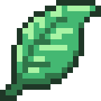

<h1>
    The mod loader for
    <a href="https://pzwiki.net/wiki/Leaf">
         leaf
    </a>
</h1>

This project is a mod loader which has the main purpose of discovering and loading Leaf mods from multiple sources, such
as the Steam Workshop, cachedir, and even via arguments! Fabric Loader (of which this project is forked from) has good
documentation which you can read if interested [here][FabricLoaderWiki].

This project is a hard fork of [FabricMC/fabric-loader][FabricLoader]!

### Requirements

- Java 8 or higher

### Usage

The intended usage for the loader is in development via [loom][LeafLoom] or in production
via [installer][LeafInstaller]. In neither situation should you need to manually install the loader yourself.

In most cases, things you will need to access from a developer-perspective will be essentially 1:1 with Fabric Loader,
excluding the Fabric API. You may reasonably assume that any such access of the loader's public API will have `leaf`
referenced inplace of `fabric`, such as `FabricLoader` being renamed to `LeafLoader`. This applies not just to Java code
but also to launch options (such as `leaf.debug.logClassLoad` instead of `fabric.debug.logClassLoad`) and the FMJ JSON
e.g. `leaf.mod.json` instead of `fabric.mod.json`.

Documentation about Fabric Loader should match documentation of Leaf Loader in most aspects, but only where the content
of it is game-agnostic. Of course, documentation specific to Project Zomboid like game paths and the cachedir will not
have equal documentation in the Fabric Wiki.

### Development

For developing your own Leaf mods, you should read the [Leaf][PZWikiPage] wiki page which will contain a top-down
summary of the entire leaf project.

### Support

If you need any help whatsoever with Leaf, you can discuss anything leaf-related on Discord through the
official [Project Zomboid Modding Community](https://discord.gg/2Vr6Wyh6Am) Discord using the appropriate channels.

### Special Thanks

- The entire [FabricMC team](https://github.com/FabricMC/)

[FabricLoader]: https://github.com/FabricMC/fabric-loader
[FabricLoaderWiki]: https://docs.fabricmc.net/develop/loader/
[LeafInstaller]: https://github.com/aoqia194/leaf-installer
[LeafLoom]: https://github.com/aoqia194/leaf-loom
[PZWikiPage]: https://pzwiki.net/wiki/Leaf
